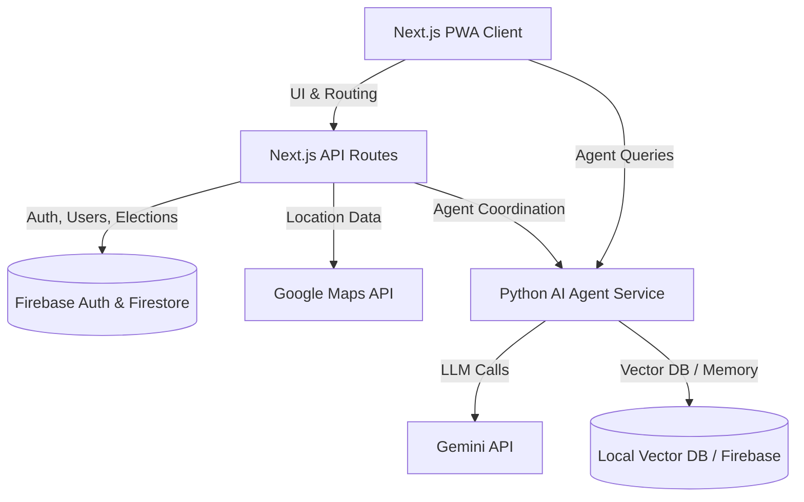
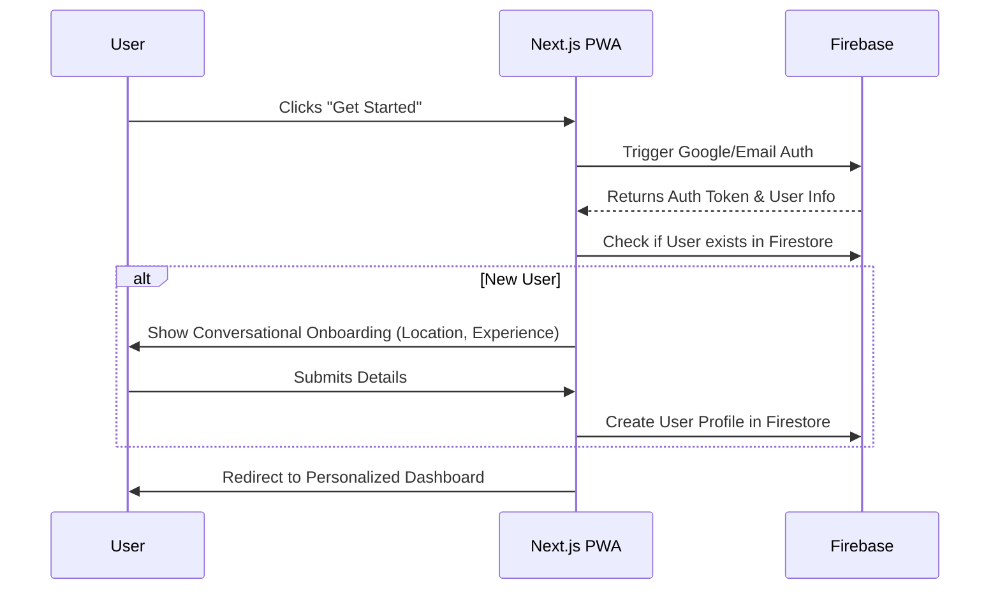
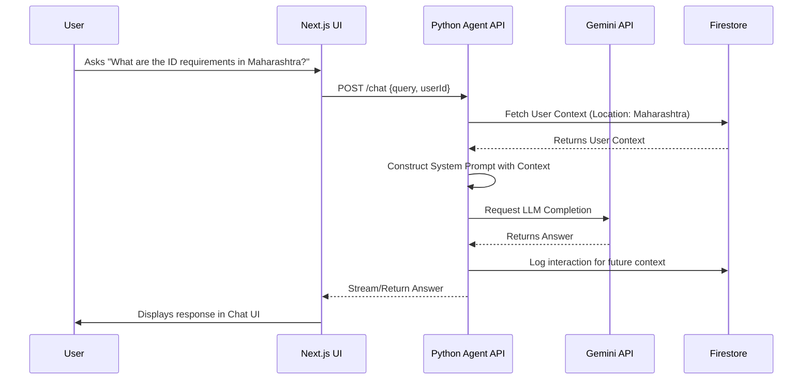
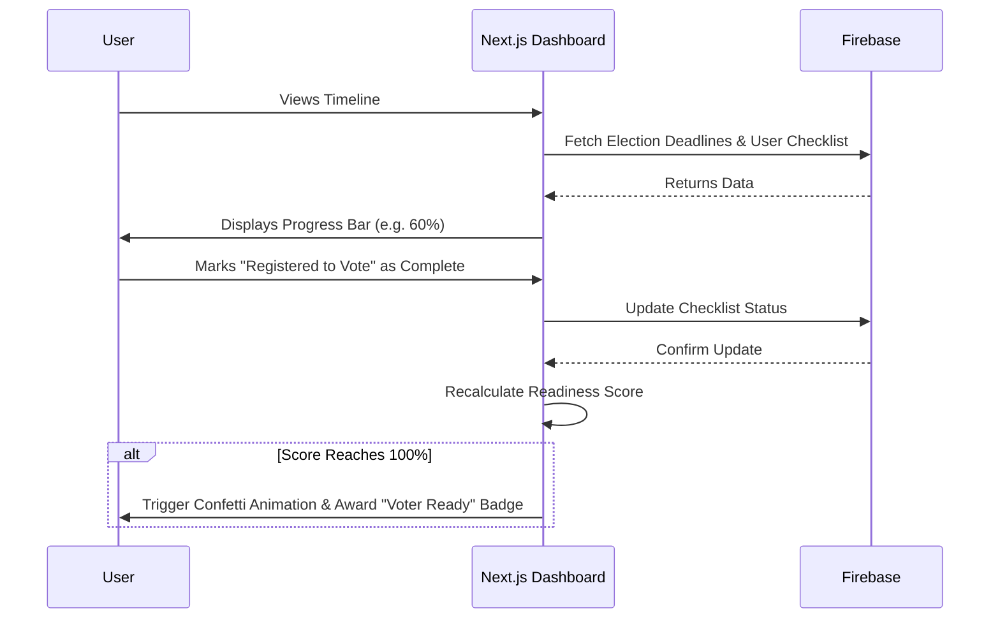
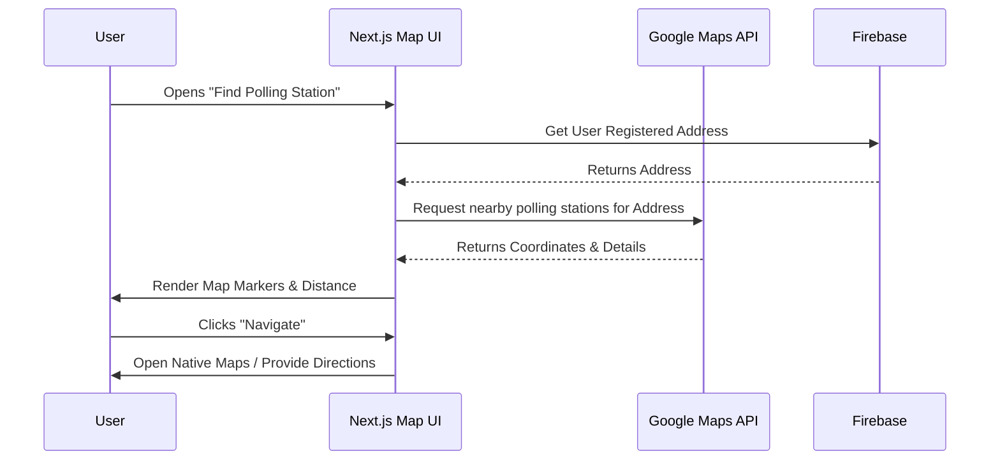

# CivicGuide – Architecture & Workflows

This document details the updated architectural blueprints and specific workflow diagrams for the CivicGuide Progressive Web App.

## 1. High-Level Architecture

## 2. Detailed Workflows

### 2.1 User Authentication & Onboarding Workflow

### 2.2 AI Agent (Python) Interaction Workflow

### 2.3 Interactive Election Journey & Gamification Workflow

### 2.4 Polling Station Finder Workflow

## 3. Technology Stack Breakdown
- **Frontend Core:** Next.js (App Router), Tailwind CSS, shadcn/ui components, Framer Motion.
- **Accessibility & Voice Layer:** Web Speech API for TTS, Context-based theming (High Contrast, Dynamic Text Sizing).
- **Main Backend:** Next.js API Routes (Serverless endpoints for standard data fetching).
- **Agent Microservice:** Python (FastAPI/Flask) handling advanced agent logic.
- **AI/LLM:** Gemini API.
- **Database:** Firebase (Auth & Firestore).
- **Location:** Google Maps API.
